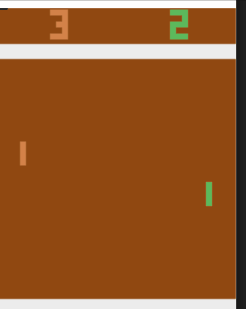

# Report

## PB18111684 吴钰同

- I choose RGB image input environment **Pong-v0** with autogard and optimization tool pytorch.
- I use **Deep Q-network** referred to a [tutorial](https://towardsdatascience.com/deep-q-network-dqn-i-bce08bdf2af) to train the agent.
- Use `train.py` to train the model.

### Technical Routes

#### Image Preprocessing

Since color and size of input images make no difference to action decision, I grayscale the RGB input to a square gray image, which helps to normalize the input.

I notice that one single screenshot can not be used to determine a unique state of pong game, because the speed direction of the ball can be different from the same screenshots. Originally, I decided to use LSTM to record time sequences. Thanks to the tutorial, I find that I can just stack continuous screenshots together as one 3D-tensor, whose channel dimension means the timestep, to help CNN distinguish dynamic features.

I also cut off score parts on the top of images because they are useless to action decision.


#### Neural Network Structure

I use three convolution layers to extract image features and two fully connected to map the features to 6 different actions. The network structure is showed as follow:

```python
DQN(
  (conv): Sequential(
    (0): Conv2d(4, 32, kernel_size=(8, 8), stride=(4, 4))
    (1): ReLU()
    (2): Conv2d(32, 64, kernel_size=(4, 4), stride=(2, 2))
    (3): ReLU()
    (4): Conv2d(64, 64, kernel_size=(3, 3), stride=(1, 1))
    (5): ReLU()
    (6): Flatten(start_dim=1, end_dim=-1)
  )
  (fc): Sequential(
    (0): Linear(in_features=3136, out_features=512, bias=True)
    (1): ReLU()
    (2): Linear(in_features=512, out_features=6, bias=True)
  )
)
```

I use DQN as Q-function, and Q(s, a) is the a-th output of DQN(s).

#### Q-learning Algorithm

I just use the algorithm in the tutorial:


Since TA's frame will exit the loop when `done` is true, so I do not care about `done ` .

The original Q-learning update `Q(s, a)` as follow:

```
Q(s,a) = (1-alpha) * Q(s,a) + alpha * (r + gamma * max Q(s',a'))
```

which `s'` is the next state when do action `a` at state `s `.

It can be interpreted as changing `Q(s,a)` closer to the max accumulated reward of doing action `a` in state `s` by learning rate alpha, so we can consider last estimated value as optimal value and use SGD to update `Q(s,a)` .

The tricks new to me in the algorithm is epsilon decay, experience replay and target network.

#### Epsilon Decay

With the progression of exploration, DQN will know more about the environment, so we should make more effort on exploitation.

In order to solve the problem, we can make epsilon exponentially decay, i.e.

```
eps = max(eps * decay_rate, eps_min)
```

#### Experience Replay

Naive SGD will be influenced by the correlation of training data, so we just save the state transitions into a replay buffer and use average loss by randomly sampling to update the arguments.

#### Target Network

Since the actions are slight, `s'` is very similar to `s` in the view of nerual networks. If we firstly update `Q(s',a')`, `Q(s,a)` will also be influenced, so when we next immediately update `Q(s,a)` through its neighbor `Q(s',a')`, it will be update twice.

To avoid the problem, we calculate estimated optimal value `y` by an older network `Q'`, and use `y` to update the real network `Q`.  Target network `Q'` are periodically synchronized with the parameters of the real Q-network. 

### Learning Analysis

Average rewards of the first 1000 training episodes are showed as follow:


Since epsilon is very small, I retrain the model with current arguments as initial arguments.


Then I render pong game as animations, and find an interesting fact:



The agent learn a must win strategy when it moves first, throwing the ball to the upleft and stay in the same place without moving, it can always win.

The ten times playing animation:

